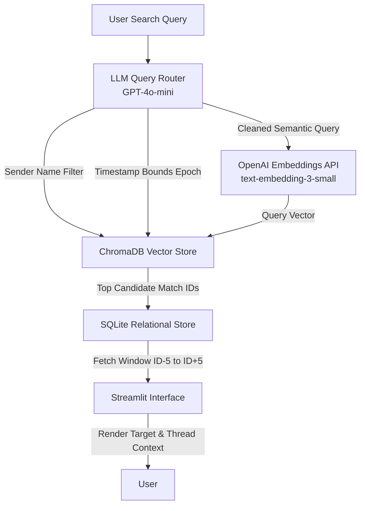

# ConvoMiner: Context-Aware Code-Mixed Group Chat Search

ConvoMiner is a context-aware search engine designed to parse multi-party conversational group chats. Traditional keyword-based search fails when users search by intent or concept rather than exact phrasing—especially in code-mixed languages (such as Hinglish) where slang, transliteration, and single-word replies are common.

ConvoMiner addresses this by decoupling query intent parsing, vector similarity retrieval, and sequential context reconstruction.

---

## System Architecture

The search pipeline splits raw natural language into structured filters and vector representations, queries a vector index with metadata pre-filtering, and reconstructs surrounding conversational context using a relational database.

### Data Flow Diagram



### Component Architecture Breakdown

```
+-----------------------------------------------------------------------------------+
|                                  USER QUERY                                       |
|                  "What did Priya say about the flat deposit?"                     |
+-----------------------------------------------------------------------------------+
                                          |
                                          v
+-----------------------------------------------------------------------------------+
|                        LLM INTENT ROUTER (GPT-4o-mini)                            |
|  - Semantic Query : "flat deposit budget limit"                                  |
|  - Sender Filter   : "Priya"                                                      |
|  - Date Range      : null                                                         |
+-----------------------------------------------------------------------------------+
                                          |
                                          v
+-----------------------------------------------------------------------------------+
|                        CHROMADB VECTOR STORE ENGINE                               |
|  - Pre-filter     : metadata.sender_name == "Priya"                               |
|  - Vector Search  : Cosine Similarity over contextual embeddings                  |
|  - Output         : Top Candidate Message ID (e.g., ID: 2011)                    |
+-----------------------------------------------------------------------------------+
                                          |
                                          v
+-----------------------------------------------------------------------------------+
|                       SQLITE SEQUENTIAL STORE ENGINE                              |
|  - Query          : SELECT * FROM messages WHERE id BETWEEN 2006 AND 2016        |
|  - Output         : 11-Message Thread Context (+/- 5 Messages)                    |
+-----------------------------------------------------------------------------------+
                                          |
                                          v
+-----------------------------------------------------------------------------------+
|                            STREAMLIT FRONTEND UI                                  |
|  - Highlights exact matched target message (ID: 2011)                            |
|  - Renders preceding and proceeding context lines for full thread awareness       |
+-----------------------------------------------------------------------------------+

```

---

## Key Technical Innovations

* **Contextual Window Embeddings:** Short replies such as "chalo done" or "ha bhai" lack independent vector representations. During ingestion, target messages are concatenated with preceding message history before generating vector embeddings, ensuring conversational context is embedded into every vector.
* **Metadata Pre-Filtering:** Attributed queries ("What did Priya say...") and temporal queries ("What did we discuss in March?") are parsed by an LLM router prior to vector search. Scalar filters are applied directly in ChromaDB before cosine similarity execution to eliminate cross-author false positives.
* **Deterministic Thread Reconstruction:** Vector databases locate semantic entry points, while SQLite reconstructs local conversational state ($\pm 5$ messages) to display contextually rich discussion threads.
* **Top-5 Recall Benchmark Evaluator:** Built directly into the application tab to run automated ground-truth benchmarks against 40 labeled queries.

---

## Tech Stack

| Layer | Component | Function |
| --- | --- | --- |
| **Frontend UI** | Streamlit | Interactive web interface for search, router inspection, and evaluation |
| **Query Routing** | OpenAI GPT-4o-mini | Pydantic-enforced structured schema parsing for query intent |
| **Vector Store** | ChromaDB | Local persistent vector index with scalar metadata pre-filtering |
| **Embeddings** | OpenAI text-embedding-3-small | Multilingual code-mixed vectorization |
| **Relational DB** | SQLite | Sequential message storage for context lookup |

---

## Repository Structure

```text
ConvoMiner/
├── app.py                  # Streamlit application UI and benchmark tab
├── search_engine.py        # Intent parser router and hybrid execution engine
├── ingester.py             # SQLite builder and ChromaDB vector generator
├── generate_dataset.py     # Synthetic 4,000-message generator and ground-truth labeller
├── datasets/
│   └── dataset_1.json      # Generated Hinglish chat corpus and test query suite
├── db/                     # Local database directory (gitignored)
│   ├── chat.db             # SQLite relational database
│   └── chroma_data/        # Persistent ChromaDB vector collections
├── requirements.txt        # Production dependencies
└── README.md               # Architecture documentation

```

---

## Setup and Installation

### Prerequisites

* Python 3.10 or higher
* OpenAI API Key

### Installation Steps

1. **Clone the Repository:**
```bash
git clone https://github.com/your-username/ConvoMiner.git
cd ConvoMiner

```


2. **Initialize Virtual Environment:**
```bash
python -m venv venv

# Mac/Linux
source venv/bin/activate

# Windows
.\venv\Scripts\activate

```


3. **Install Dependencies:**
```bash
pip install -r requirements.txt

```


4. **Set Environment Variable:**
```bash
# Mac/Linux
export OPENAI_API_KEY="your-openai-api-key"

# Windows (CMD)
set OPENAI_API_KEY="your-openai-api-key"

# Windows (PowerShell)
$env:OPENAI_API_KEY="your-openai-api-key"

```


---

## Execution Pipeline

Run the three execution steps sequentially to build the dataset, index the database, and launch the application:

```bash
# Step 1: Generate synthetic 4,000-message Hinglish dataset with ground-truth test suite
python generate_dataset.py

# Step 2: Ingest dataset into SQLite and generate contextual embeddings in ChromaDB
python ingester.py

# Step 3: Launch Streamlit web interface
streamlit run app.py

```

---

## Evaluation Benchmark Methodology

System accuracy is tested using **Top-5 Recall** across three query shapes:

* **Semantic Queries:** Tests zero-keyword semantic matches (e.g., query *"when did we decide on the trip destination?"* matching target message *"chalo Manali fix hai phir"*).
* **Attributed Queries:** Verifies author pre-filtering (e.g., query *"what did Priya say about the budget"* pre-filtering for `sender_name == 'Priya'`).
* **Temporal Queries:** Verifies epoch date bound extraction (e.g., query *"what did we discuss last month"* restricting timestamp vectors).

A query is scored as a **PASS** if the target ground-truth message ID falls within the retrieved $\pm 5$ context window of any top-5 candidate returned by the search engine.